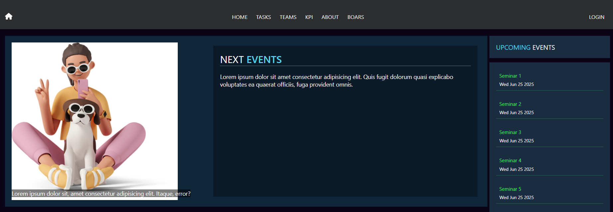
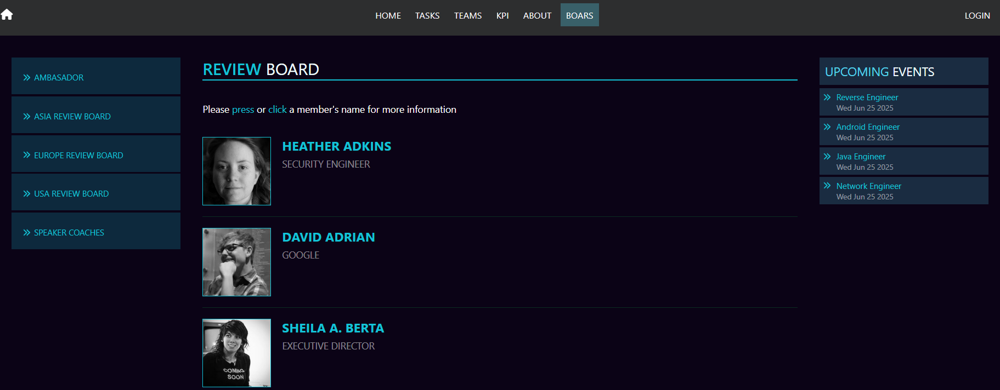
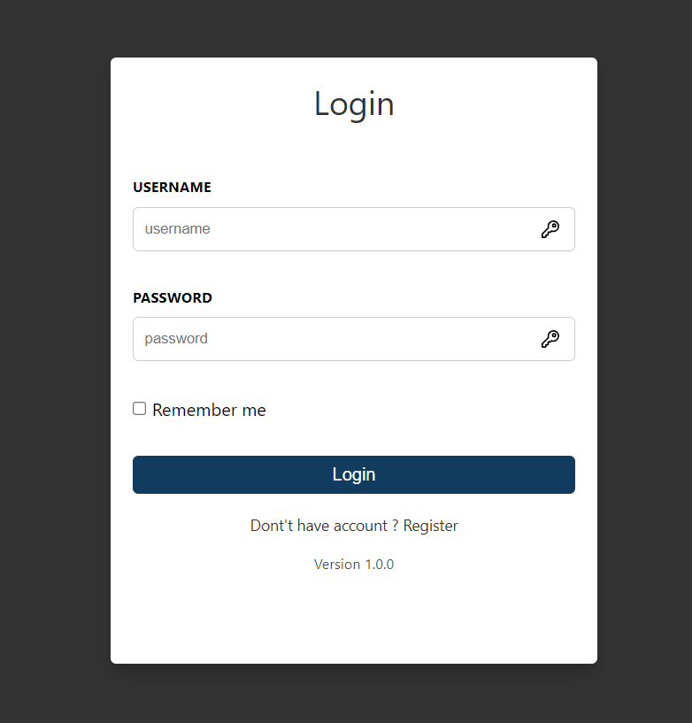

# TaskClient
Angular version 19.2.10.

## Development server
This is a web client for task manager restful api `http://localhost:3000/api` 

home screen 

make use of existing css from generated cli from angular
`
routes:
    - '' --> home
    - '/tasks' --> TaskComponent
    - '/teams' --> TeamsComponent
    - '/kpi' --> KpiComponent
    - '/users' --> UsersComponent
    - '/faq' --> FaqComponent
`